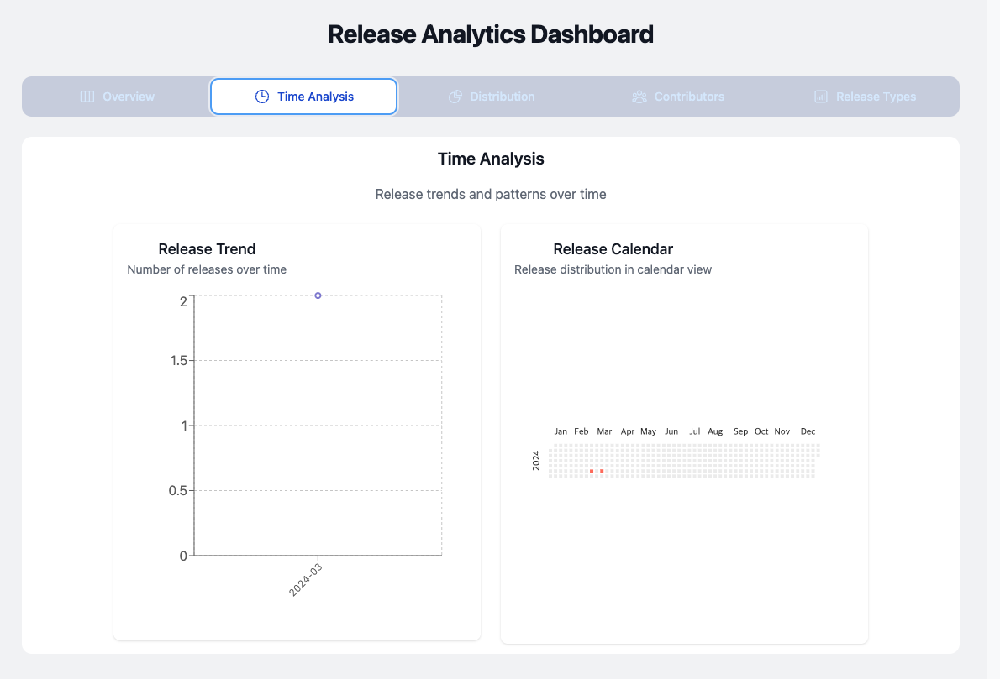
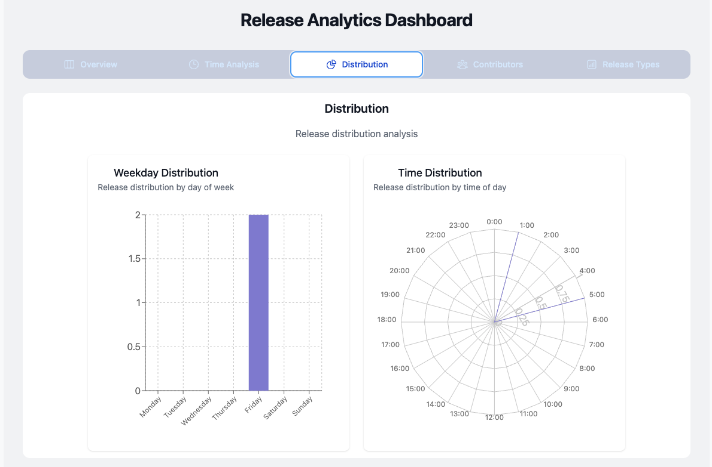
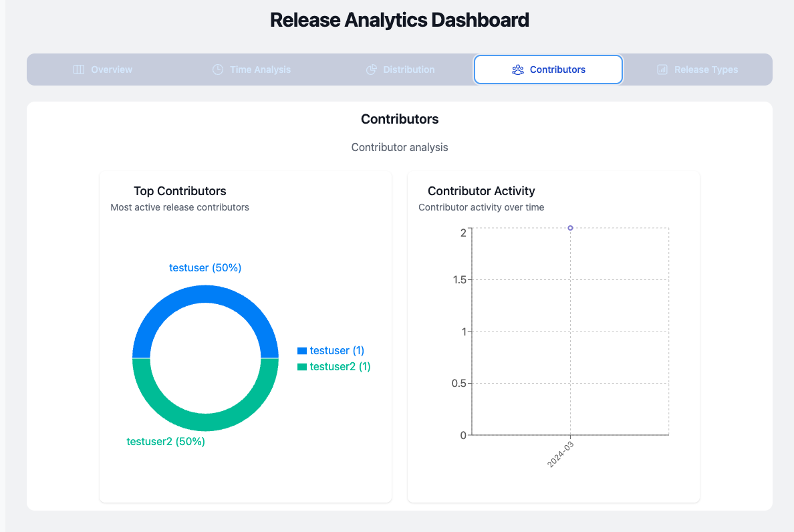
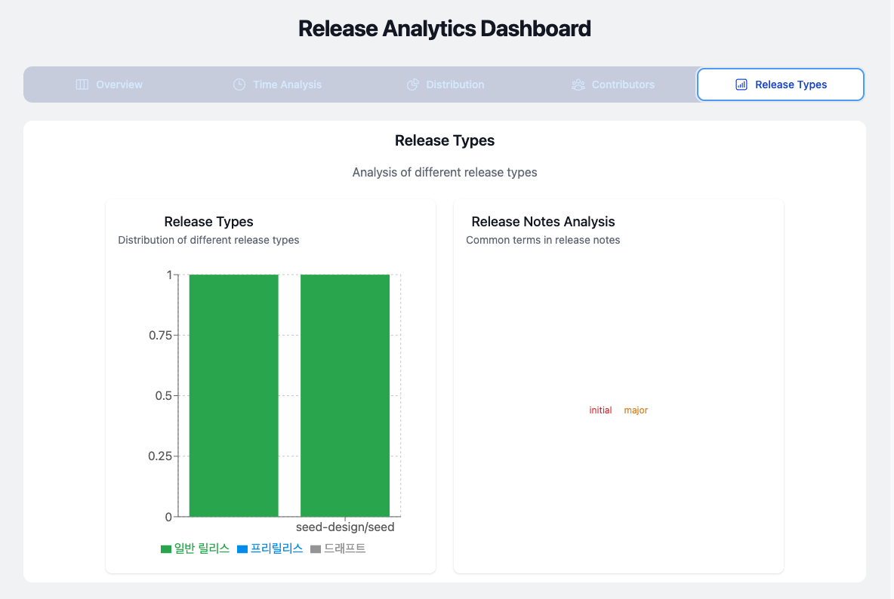

# Release Tracker Dashboard

📊 프로젝트 개요

Release Tracker는 Github 릴리즈 데이터를 다양한 관점에서 시각화하여,
팀의 개발/릴리즈 활동 패턴을 한눈에 볼 수 있는 대시보드 서비스입니다.

- 단순 데이터 수집을 넘어, 의미 있는 인사이트 도출이 목표입니다.
- 직관적이고 반응형인 대시보드에서 누구나 쉽게 팀의 릴리즈 현황을 파악할 수 있습니다.

---

🖼️ 대시보드 구성

### 1. 시계열 기반 차트 (Time Analysis)



#### 릴리스 트렌드 라인 차트

- **구현**: `TimelineChart` 컴포넌트
- **라이브러리**: recharts (`LineChart`)
- **데이터 처리**: `prepareTimelineData()` - 월별 릴리스 수 집계
- **시각화 방식**: 월별 릴리스 수 변화를 연속적인 라인으로 표현
- **👉 인사이트**: 릴리스 주기와 시즌별 패턴 파악

#### 히트맵 캘린더

- **구현**: `CalendarChart` 컴포넌트
- **라이브러리**: @nivo/calendar
- **데이터 처리**: `prepareCalendarData()` - 일별 릴리스 수를 YYYY-MM-DD 형식으로 변환
- **시각화 방식**: 일별 릴리스 밀도를 색상 강도로 표현
- **👉 인사이트**: 릴리스가 집중되는 요일/주차 파악

### 2. 분포 차트 (Distribution)



#### 요일별 릴리스 바 차트

- **구현**: `WeekdayBarChart` 컴포넌트
- **라이브러리**: recharts (`BarChart`)
- **데이터 처리**: `prepareWeekdayData()` - 요일별 릴리스 수 집계
- **시각화 방식**: 7개 요일의 릴리스 건수를 세로 막대로 비교
- **👉 인사이트**: 선호되는 릴리스 요일 파악

#### 시간대별 방사형 차트

- **구현**: `TimeRadarChart` 컴포넌트
- **라이브러리**: recharts (`RadarChart`)
- **데이터 처리**: `prepareTimeDistributionData()` - 24시간 기준 릴리스 시간 분포
- **시각화 방식**: 24시간을 방사형으로 배치하여 시간대별 분포 표현
- **👉 인사이트**: 선호 릴리스 시간대 분석

### 3. 기여자 분석 (Contributors)



#### 기여자별 도넛 차트

- **구현**: `ContributorDonutChart` 컴포넌트
- **라이브러리**: recharts (`PieChart`)
- **데이터 처리**: `prepareContributorData()` - 상위 5명 기여자 + Others
- **시각화 방식**: 기여자별 릴리스 비율을 도넛 형태로 표현
- **👉 인사이트**: 주요 기여자 및 릴리스 작성 집중도 파악

### 4. 릴리스 유형 분석 (Release Types)

#### 스택 바 차트

- **구현**: `ReleaseTypeBarChart` 컴포넌트
- **라이브러리**: recharts (`BarChart` with stacked bars)
- **데이터 처리**: `prepareReleaseTypeData()` - 레포지토리별 릴리스 타입 분류
- **시각화 방식**: 정식/프리릴리스/드래프트를 누적 막대로 표현
- **👉 인사이트**: 릴리스 프로세스 성숙도 및 타입 분포 확인

### 5. 릴리스 노트 분석 (Release Notes)



#### 워드 클라우드

- **구현**: `WordCloudChart` 컴포넌트
- **데이터 처리**: `prepareWordCloudData()` - 불용어 제거 및 빈도수 기반 상위 50개 단어
- **시각화 방식**:
  - 단어 크기: 빈도수에 따라 12px ~ 48px
  - 색상: HSL 색상환 기반 다양한 색상 자동 생성
  - 투명도: 빈도수에 따라 30% ~ 100%
- **👉 인사이트**: 주요 변경점 및 이슈 트렌드 파악

---

🧩 기술 스택 및 패키지

#### 차트 라이브러리

- **recharts**: 기본 차트 구현 (라인, 바, 도넛, 레이더)
- **@nivo/calendar**: 캘린더 히트맵 구현

#### 데이터 처리

- **date-fns**: 날짜 파싱 및 포맷팅
- **CSV 파싱**: 자체 구현 파서 사용

#### UI/스타일링

- **Tailwind CSS**: 반응형 레이아웃 및 스타일링
- **Flex & Grid**: 차트 레이아웃 구성

---

🏷️ 주요 타입 정의

```typescript
type ChartType = 'timeline' | 'heatmap' | 'bar' | 'radar' | 'donut' | 'stackedBar' | 'wordcloud'

type CategoryId = 'overview' | 'time' | 'distribution' | 'contributors' | 'types'

interface DashboardChart {
  id: string
  title: string
  description: string
  type: ChartType
  category: CategoryId
  dimensions: {
    width: number
    height: number
  }
}
```

---

📐 레이아웃 구성

- **차트 컨테이너**: 400px 고정 높이
- **반응형 설계**:
  - `w-full` 클래스로 컨테이너 너비에 맞춤
  - Flex와 Grid 조합으로 유동적 배치
- **일관된 마진**: `margin: { top: 20, right: 30, left: 20, bottom: 5 }`
- **여백과 간격**: gap-4, p-4 등 일관된 spacing

---

💡 주요 인사이트 도출 포인트

1. **시간적 패턴**

   - 월별/요일별 릴리스 트렌드
   - 선호되는 릴리스 시간대

2. **기여도 분석**

   - 핵심 기여자 식별
   - 릴리스 작성 분산도

3. **릴리스 프로세스**

   - 정식/프리릴리스/드래프트 비율
   - 레포지토리별 릴리스 성숙도

4. **키워드 트렌드**
   - 주요 변경사항 키워드
   - 이슈/버그픽스 패턴

---

#### 서버 구현

- Express 기반의 REST API 서버 구축
- 데이터 처리 로직을 서버로 이전
- 메모리 기반 데이터 관리 구현
- 각 차트별 전용 API 엔드포인트 제공

#### API 엔드포인트

- `GET /api/dashboard`: 전체 대시보드 데이터
- `GET /api/timeline`: 시계열 차트 데이터
- `GET /api/calendar`: 캘린더 히트맵 데이터
- `GET /api/weekday`: 요일별 분포 데이터
- `GET /api/time-distribution`: 시간대별 분포 데이터
- `GET /api/contributors`: 기여자 분석 데이터
- `GET /api/release-types`: 릴리스 타입 분석 데이터
- `GET /api/word-cloud`: 릴리스 노트 키워드 분석 데이터

#### 클라이언트 개선

- API 통신 로직 구현
- 데이터 타입 정의 개선
- 에러 처리 및 로딩 상태 관리 강화

#### 기술 스택 업데이트

- 서버: Express, date-fns, TypeScript
- API: REST, JSON
- 통신: fetch API, CORS 지원
